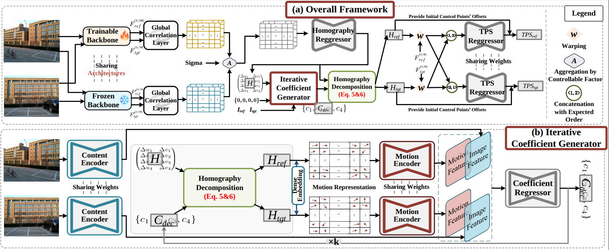

<h1>
  Robust Image Stitching with Optimal Plane
</h1>

<p align="center">
  
</p>

> **[Robust Image Stitching with Optimal Plane](https://arxiv.org/abs/2508.05903)**
>
> [Lang Nie](https://nie-lang.github.io/), [Yuan Mei](), [Kang Liao](https://kangliao929.github.io/), [Yunqiu Xu](), [Chunyu Lin](), [Bin Xiao]()

>
> [](https://arxiv.org/abs/2508.05903)


## Dataset
We use the UDIS-D dataset to train and evaluate our method. Please refer to [UDIS](https://github.com/nie-lang/UnsupervisedDeepImageStitching) for more details about this dataset. For cross-scenario validation, we have assembled 147 pairs of traditional image stitching pairs, and the associated dataset is available for download [here](https://drive.google.com/file/d/1_F7M7DN7K4BjZPEcez7XS6TUpE3iEX8f/view?usp=drive_link).


## Code
#### 🖥️ Requirement
numpy >= 1.19.5

pytorch >= 1.7.1

scikit-image >= 0.15.0

tensorboard >= 2.9.0

## ✈️ Training
### Step1: Training the Aligment Model
```
cd ./woCoefNet/Codes/
python train.py
```

### Step2: Training the Iterative Coefficient Generator

```
cd ./wCoefNet/Codes/
python train.py --woCoefNet_path your_model_path
```
## 🖼️ Testing 
Our pretrained models can be available at [Google Drive](https://drive.google.com/drive/folders/1U3kcNM7n_txQ69fjw7wT9EUyAVQZjDxC?usp=drive_link).

```
cd ./wCoefNet/Codes/
python test.py --woCoefNet_path your_model_path
```

## 🖼️ Fine-tuning

```
cd ./wCoefNet/Codes/
python test_finetune.py --woCoefNet_path your_model_path
```

## 📚 Citation

If you find RopStitch useful for your research or applications, please cite our paper using the following BibTeX:

```bibtex
  @article{nie2026robust,
  title={Robust Image Stitching with Optimal Plane},
  author={Nie, Lang and Mei, Yuan and Liao, Kang and Xu, Xunqiu and Lin, Chunyu and Xiao, Bin},
  journal={IEEE Transactions on Visualization and Computer Graphics},
  year={2026},
  publisher={IEEE}
}
```

## Meta
If you have any questions about this project, please feel free to drop me an email.

Yuan Mei -- 2551161628@qq.com
